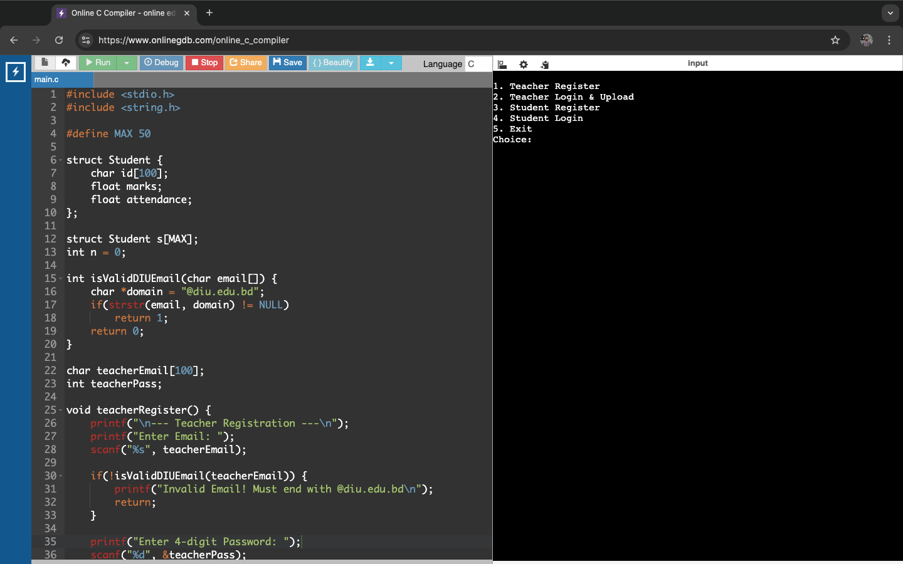
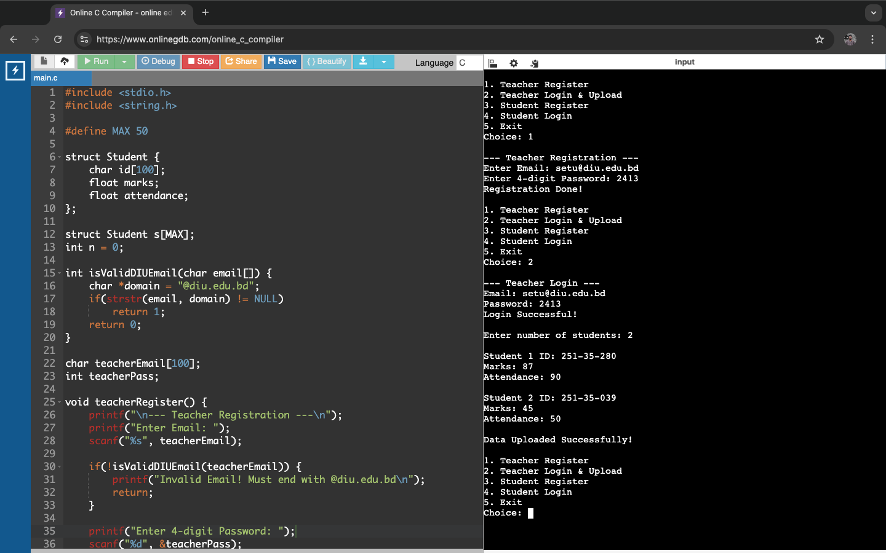
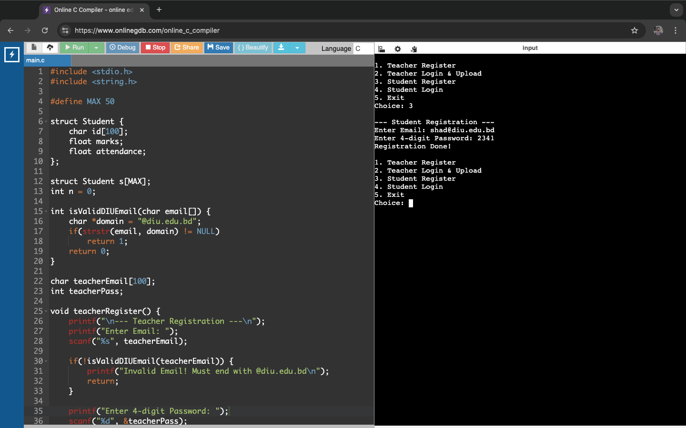
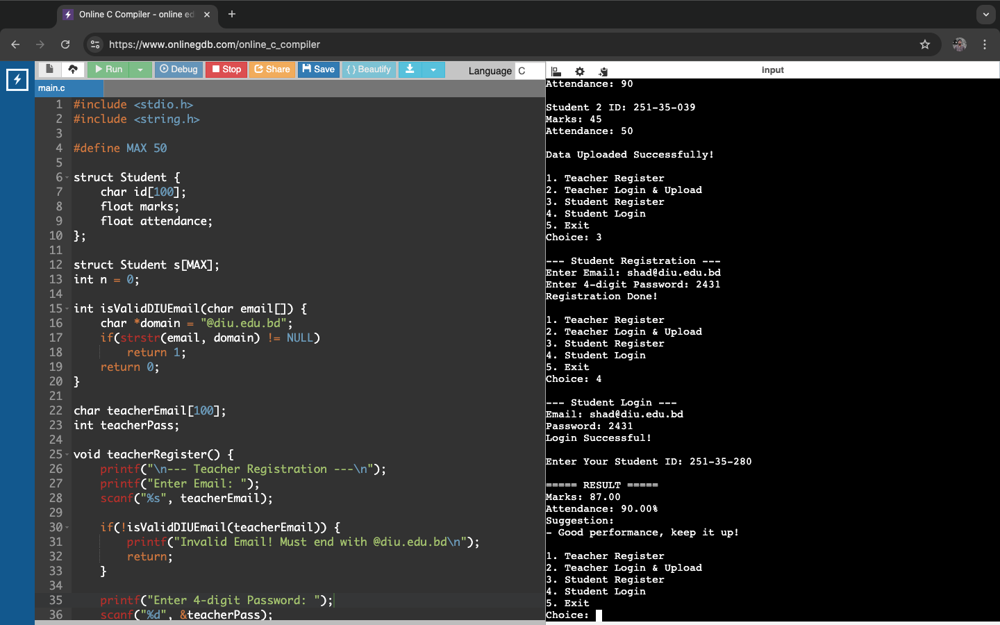
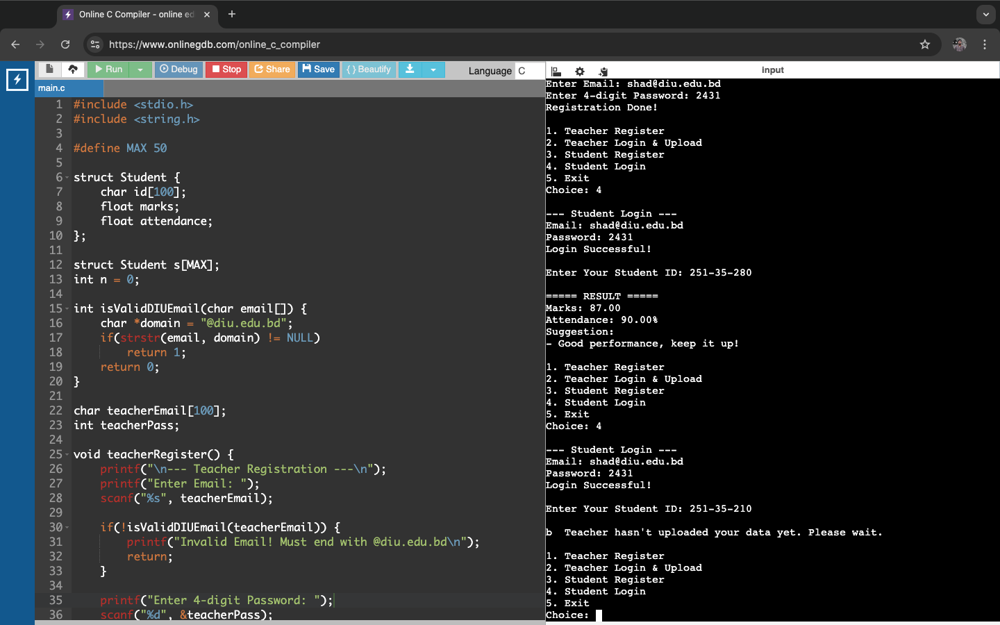

## Student Evaluation Portal (C)

## Project Overview  
This is a console-based application developed using the C programming language. It helps teachers manage student academic data and allows students to view their results easily. The system also provides performance-based suggestions and alerts based on marks and attendance.

## Features  
- Teacher registration and login  
- Student registration and login  
- DIU email validation system  
- Upload student marks and attendance  
- View student results  
- Generate performance suggestions  
- Alert if data is not uploaded  

## Technologies Used  
- C Programming  
- Console Application  

## Project Screenshots  

### Main Output  


### Teacher Portal  


### Student Registration  


### Student Result & Suggestion  


### Teacher Not Upload Mark Alert  


## Learning Integration  
This project is developed based on concepts learned from:  
- Google Project Management  
- Google Data Analytics  
- IBM Software Engineering  
- Meta Version Control  

## How to Run  

1. Compile the program:
```bash
gcc student_evaluation.c -o student_evaluation
```

2. Run the program:
```bash
./student_evaluation
```

## Author  
Md Tasnimul Islam Shad  

## Conclusion  
This project demonstrates how C programming can be used to build a simple and efficient student evaluation system. It helps manage academic data and provides useful feedback to improve student performance.an be used to build a simple yet effective student evaluation system. It integrates authentication, data management, and decision-based suggestions to solve real-life academic problems efficiently.
